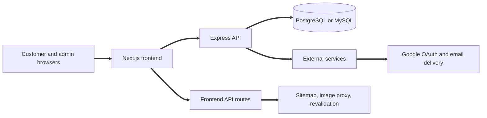

# MK Reddy General Stores

MK Reddy General Stores is a full stack grocery platform with a Next.js storefront and an Express API. It supports customer ordering, admin operations, bilingual catalog data, and a production grade security posture.

## Table of Contents

1. [Executive Summary](#executive-summary)
2. [User Journeys](#user-journeys)
3. [Application Architecture](#application-architecture)
4. [Visual Overview](#visual-overview)
5. [Route Map](#route-map)
6. [Component and Feature Organization](#component-and-feature-organization)
7. [State and Data Strategy](#state-and-data-strategy)
8. [API Client Design](#api-client-design)
9. [Authentication UX Behavior](#authentication-ux-behavior)
10. [Caching and Deduplication](#caching-and-deduplication)
11. [Styling and UI System](#styling-and-ui-system)
12. [Project Layout](#project-layout)
13. [Environment Configuration](#environment-configuration)
14. [Developer Workflow](#developer-workflow)
15. [Testing Strategy](#testing-strategy)
16. [Build and Deployment Guidance](#build-and-deployment-guidance)
17. [Route and Sub Route Screenshots](#route-and-sub-route-screenshots)
18. [Troubleshooting](#troubleshooting)

## Executive Summary

This system delivers a production ready grocery storefront with a full admin console.

* Next.js App Router frontend with SEO, lazy loading, and responsive UI
* Express API with PostgreSQL by default and optional MySQL support
* Google OAuth and email OTP authentication with profile completion
* Bilingual product catalog with English and Telugu translations
* Admin operations for catalog, promotions, orders, invoices, and reports

## User Journeys

Customer journey

1. Land on the home page and browse categories
2. Search for products and open product detail
3. Add items to cart and proceed to checkout
4. Place an order and track its status
5. Review invoices and order history

Admin journey

1. Log in and access the dashboard
2. Manage categories, products, and pricing
3. Configure promotions and birthday campaigns
4. Monitor orders, inventory, and notifications
5. Review reports and export data

## Application Architecture



## Visual Overview


## Route Map

Storefront routes

* / for home and category navigation
* /products for full catalog
* /products/\[id] for product detail and variants
* /category/\[category] for parent category view
* /category/\[category]/\[subcategory] for subcategory view
* /search for keyword search and suggestions
* /featured, /hot-deals, /new-arrivals, /recently-updated for curated lists

Account and checkout routes

* /login for Google OAuth and email OTP
* /checkout for cart review and order placement
* /orders and /orders/\[id] for order history and detail
* /profile and /profile/settings for account management

Admin routes

* /admin/dashboard for analytics and operations
* /admin/billing for invoice review and printing
* /admin/birth-day for birthday offer assignment
* /admin/voice-dictionary for Telugu voice dictionary management

API entry points

* /api/v1 for the backend API
* /api for frontend server routes

## Component and Feature Organization

Frontend highlights

* app routes for public, account, and admin pages
* components organized by domain and shared UI
* services wrapping API calls and token handling

Backend highlights

* routes map HTTP endpoints to controllers
* services hold business logic and orchestration
* models encapsulate database queries

## State and Data Strategy

* Frontend state uses providers for language, cart, categories, promotions, and dialogs
* Language selection is stored in a cookie and reused in API requests
* Backend uses translation tables for localized names and descriptions
* Mutations invalidate caches to keep lists consistent

## API Client Design

* Frontend services centralize API calls and token attachment
* Authenticated requests include Authorization headers
* Errors are normalized into consistent messages
* Revalidate calls are signed with HMAC for safety

## Authentication UX Behavior

* Google OAuth is the primary login method
* Email OTP is supported for customers
* Admin login uses password and OTP
* Profile completion is enforced for display name, date of birth, and phone
* Account merge resolves phone and email conflicts

## Caching and Deduplication

* Backend caches category and product lists with TTLs
* Cache invalidation runs on create, update, and delete actions
* Frontend lazy loading avoids heavy initial bundles
* Image proxy responses are cached for reuse

## Styling and UI System

* Tailwind CSS utility classes with consistent spacing and typography
* Reusable layout shell for navbar, footer, and mobile navigation
* Skeleton states for data heavy sections

## Project Layout

```
backend/
  src/
  scripts/
frontend/
  app/
  components/
  services/
docs/
  images/
```

## Environment Configuration

Backend core

* NODE\_ENV
* PORT
* DB\_HOST
* DB\_PORT
* DB\_USER
* DB\_PASSWORD
* DB\_NAME
* DB\_TYPE

Backend auth and security

* JWT\_SECRET
* JWT\_REFRESH\_SECRET
* GOOGLE\_CLIENT\_ID
* GOOGLE\_CLIENT\_SECRET
* REVALIDATION\_SECRET

Backend email and OTP

* SMTP\_HOST
* SMTP\_PORT
* SMTP\_USER
* SMTP\_PASS

Frontend

* NEXT\_PUBLIC\_API\_URL
* NEXT\_PUBLIC\_SITE\_URL
* NEXT\_PUBLIC\_GOOGLE\_CLIENT\_ID
* SERPAPI\_KEY
* SERPAPI\_KEY\_2
* SERPAPI\_KEY\_3

## Developer Workflow

Backend

1. cd backend
2. npm install
3. npm run migrate
4. npm run dev

Frontend

1. cd frontend
2. npm install
3. npm run dev

Screenshot automation

1. cd frontend
2. npm run screenshots:auth
3. Log in with Google OAuth in the opened browser
4. Press Enter in the terminal to save the session
5. npm run screenshots

## Testing Strategy

* Backend tests run with Jest
* Manual verification for UI flows and admin operations
* Screenshot capture validates key routes visually

## Build and Deployment Guidance

* Set environment variables for the target environment
* Run backend migrations before starting the API
* Build frontend with npm run build
* Start backend with npm start and frontend with npm run start
* Verify health endpoints after deployment

## Route and Sub Route Screenshots

Public and account routes

* Home: 
* Products: 
* Product detail: 
* Category: 
* Subcategory: 
* Search: 
* Login: 
* Checkout: 
* Orders: 

Admin routes and sections

* Dashboard: 
* Products tab: 
* Categories tab: 
* Orders tab: 
* Pricing tab: 
* Promotions tab: 
* Users tab: 
* Settings tab: 
* Billing: 
* Birth day: 
* Voice dictionary: 

## Troubleshooting

* Login loop on protected routes: confirm tokens are present and not expired
* API requests fail: verify NEXT\_PUBLIC\_API\_URL and backend health
* Missing images: verify the image proxy and image search keys
* Cache not updating: clear cache via the admin cache endpoint
* Screenshot capture fails: close Edge and verify SCREENSHOT\_USER\_DATA\_DIR

