# MK Reddy General Stores — Backend API

[](https://nodejs.org)
[](https://expressjs.com)
[](https://www.postgresql.org)
[]()
[]()
[]()
[](https://opensource.org/licenses/ISC)

<div align="center">
  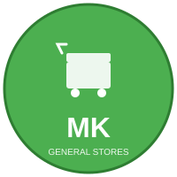
  
  **Production-ready REST API for a neighbourhood grocery kirana store**
  
  UUID v7 Primary Keys • Bilingual (English + Telugu) with Auto-Translation • OTP Authentication • GST-Compliant Invoices • Auto-SKU Generation • Real-time Stock Management
  
  **87+ API routes • 109 products • 27 categories • 48 integration tests • 100% passing**
</div>

---

## 📸 Visual Overview

<table>
  <tr>
    <td>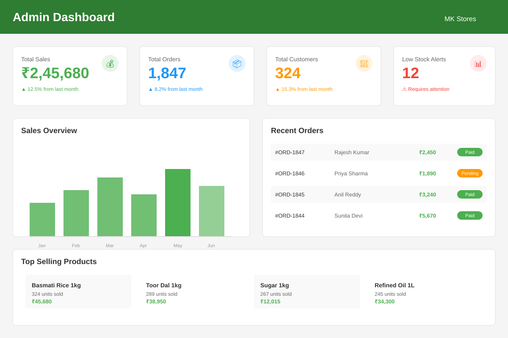<br/><b>Admin Dashboard</b></td>
    <td>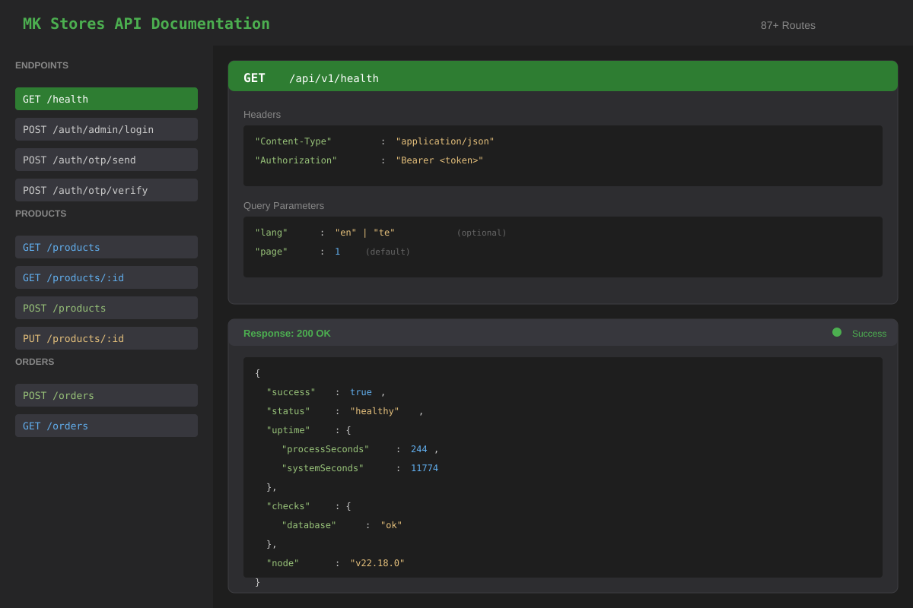<br/><b>Interactive API Docs</b></td>
  </tr>
  <tr>
    <td><br/><b>Telugu Language Support</b></td>
    <td>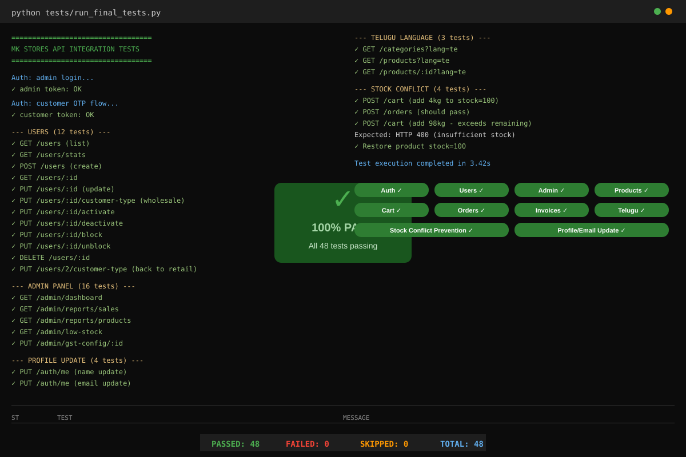<br/><b>48/48 Tests Passing</b></td>
  </tr>
</table>

---

## Table of Contents

- [Features](#features)
- [Architecture](#architecture)
- [Project Structure](#project-structure)
- [Quick Start](#quick-start)
- [Environment Variables](#environment-variables)
- [Database Setup](#database-setup)
- [API Overview](#api-overview)
- [Authentication](#authentication)
- [Development Notes](#development-notes)
- [Tech Stack](#tech-stack)

---

## Features

- **UUID v7 Primary Keys** — all 15 tables use time-sortable UUID v7 identifiers generated by a custom PostgreSQL `uuid_generate_v7()` function. IDs are chronologically ordered and globally unique — no sequential integers, no enumeration attacks.
- **Auto-Translation (English → Telugu)** — creating or updating a product/category automatically translates the name and description to Telugu via Google Translate. No manual Telugu input required; override by providing `name_te` / `description_te` explicitly.
- **Auto-SKU Generation** — SKUs are automatically generated from `{BRAND}-{NAME}-{VARIANT}-{SUFFIX}` when not provided. Custom SKUs are still accepted; uniqueness is enforced either way.
- **OTP Phone Login** — customers log in with phone + OTP (no passwords). SMS delivered via Fast2SMS; bypassed automatically in `development` mode (OTP is logged to console).
- **Bilingual Catalogue** — every product and category carries both English and Telugu translations stored in separate translation tables. Pass `?lang=te` to any listing endpoint to receive localised names and descriptions.
- **Role-Based Access** — three roles (`admin`, `retail_customer`, `wholesale_customer`) with UUID-based role resolution. JWT middleware enforces access on every protected route.
- **Cart & Orders** — full cart lifecycle; order placement atomically deducts stock with a first-come-first-served conflict guard.
- **GST-Compliant Invoices** — auto-generated invoices with line-item GST breakdown; downloadable as HTML.
- **Wholesaler Pricing** — admins can promote customers to `wholesale` tier; pricing logic is ready to differentiate per tier.
- **WhatsApp Notifications** — order confirmation messages via Twilio or 360dialog (skipped in `development`).
- **Admin Logs** — every admin action (create/update/delete user, product, order) is recorded in `admin_logs` with UUID entity references.
- **Rate Limiting & Security** — Helmet, CORS, xss-clean, express-rate-limit on all routes; stricter per-minute limiter on OTP routes.
- **Excel Reports** — sales and inventory reports exportable to `.xlsx`.

---

## Architecture

### System Overview

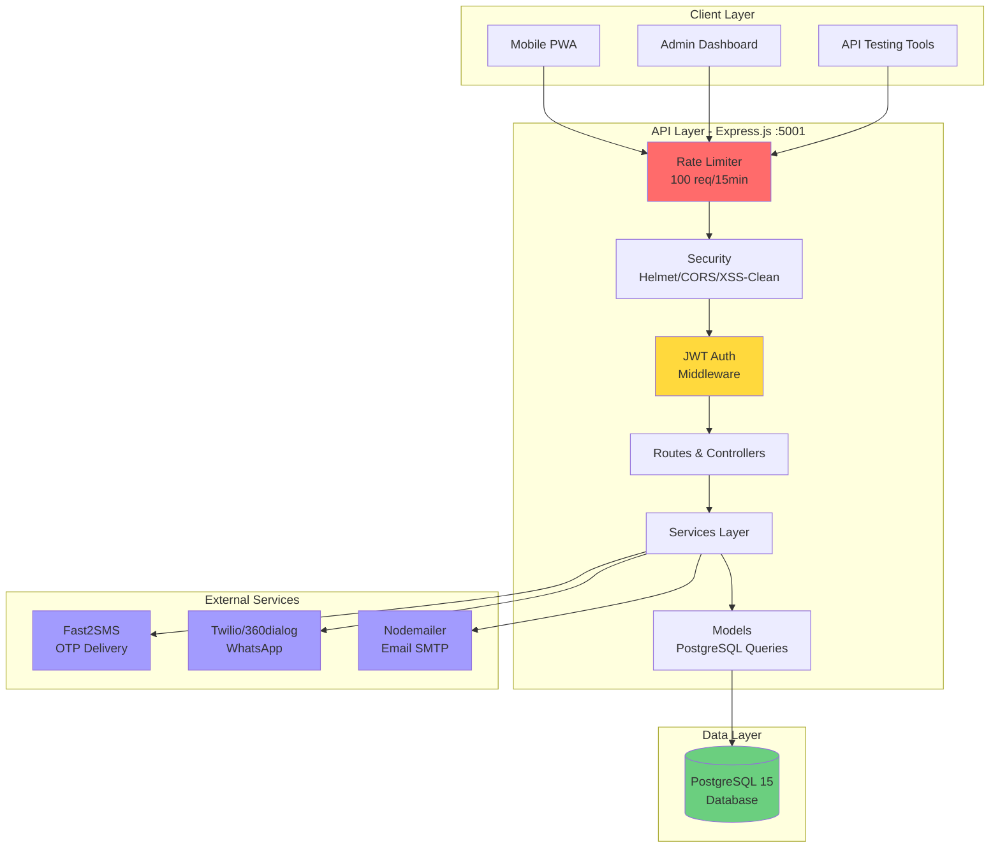

### Authentication Flow

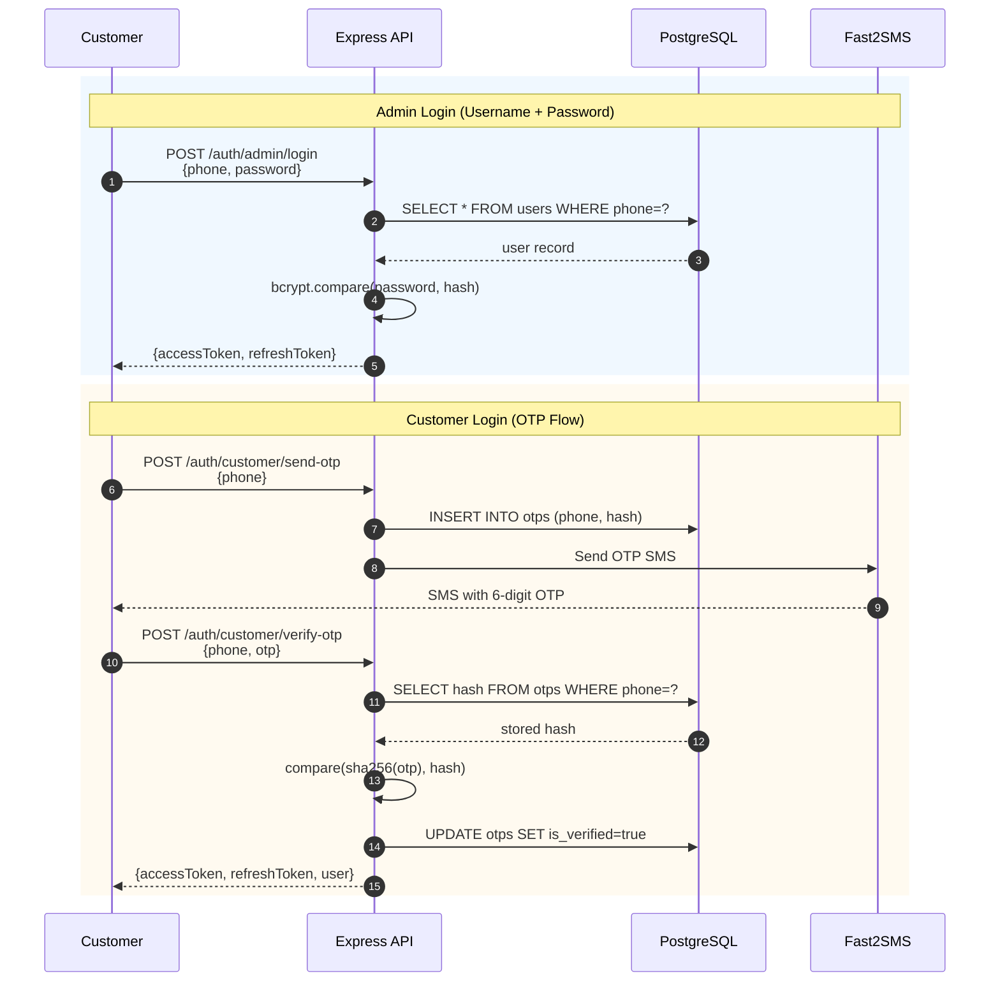

### Database Schema (Core Tables)

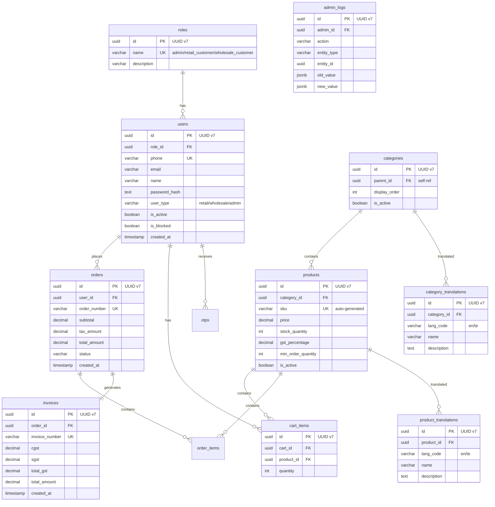

### Request Lifecycle

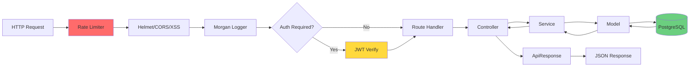

---

## Project Structure

```
backend/
├── src/
│   ├── server.js           # HTTP server entry point
│   ├── app.js              # Express app, middleware wiring
│   ├── config/
│   │   ├── database.js     # PostgreSQL pool, query/insert/modify helpers
│   │   └── index.js        # All config from process.env
│   ├── routes/             # One file per resource
│   ├── controllers/        # Thin — validate, call service, respond
│   ├── services/           # Business logic layer
│   ├── models/             # PostgreSQL query wrappers (no ORM)
│   ├── middlewares/        # auth, errorHandler, rateLimiter, upload
│   ├── database/
│   │   ├── schema.sql      # Full DDL — 15 tables (UUID v7 PKs)
│   │   └── migrate.js      # Runs schema.sql
│   └── utils/
│       ├── ApiError.js     # Typed HTTP errors
│       ├── ApiResponse.js  # Standardised JSON envelope
│       ├── validators.js   # express-validator rule-sets (UUID format)
│       ├── helpers.js      # OTP, SKU gen, role resolver, pagination
│       └── translate.js    # Google Translate auto-translation (EN→TE)
├── logs/                   # Winston log files (gitignored)
├── .env.example            # Copy to .env and fill in values
└── package.json
```

---

## Quick Start

### Prerequisites

| Requirement | Minimum version |
|---|---|
| Node.js | 18 LTS |
| PostgreSQL | 14 |
| npm | 8 |

### 1 — Clone & install

```bash
git clone <repo-url>
cd MK-REDDY-GENRAL-STORES/backend
npm install
```

### 2 — Configure environment

```bash
cp .env.example .env
# Edit .env — set DB_PASSWORD, JWT_SECRET, JWT_REFRESH_SECRET at minimum
```

### 3 — Create the database and run migrations

```bash
# In psql
CREATE DATABASE mk_kirana_stores;

# Back in the project
npm run migrate   # creates all 15 tables with UUID v7 PKs
```

The database is ready to use. Create the admin user via the API or directly in psql:

```sql
-- Insert admin role and user (replace password_hash with a bcrypt hash of your password)
SELECT id FROM roles WHERE name = 'admin';  -- get the admin role UUID
-- Then insert your admin user with INSERT INTO users (...)
```

### 4 — Start the server

```bash
npm run dev     # nodemon — auto-restart on change
# or
npm start       # plain node
```

Server will be available at `http://localhost:5001`.

---

## Environment Variables

See [backend/.env.example](backend/.env.example) for a fully annotated template.

| Variable | Required | Default | Description |
|---|---|---|---|
| `NODE_ENV` | Yes | `development` | `development` \| `production` |
| `PORT` | No | `5001` | HTTP listen port |
| `DB_HOST` | Yes | `localhost` | PostgreSQL host |
| `DB_PORT` | No | `5432` | PostgreSQL port |
| `DB_USER` | Yes | `postgres` | DB username |
| `DB_PASSWORD` | Yes | — | DB password |
| `DB_NAME` | Yes | `mk_kirana_stores` | Database name |
| `JWT_SECRET` | Yes (prod) | — | 64-char random string |
| `JWT_REFRESH_SECRET` | Yes (prod) | — | 64-char random string |
| `SMTP_USER` | Yes (prod) | — | Gmail address |
| `SMTP_PASSWORD` | Yes (prod) | — | Gmail App Password |
| `FAST2SMS_API_KEY` | No | — | Not needed in `development` |
| `STORE_GST_NUMBER` | Yes (prod) | — | GST registration number |

> **Development mode** — OTP is **NOT** sent via SMS; it is printed to the console log instead. WhatsApp notifications are also suppressed. No external API keys are needed to run locally.

---

## Database Setup

### Entity Relationship Diagram

<div align="center">
  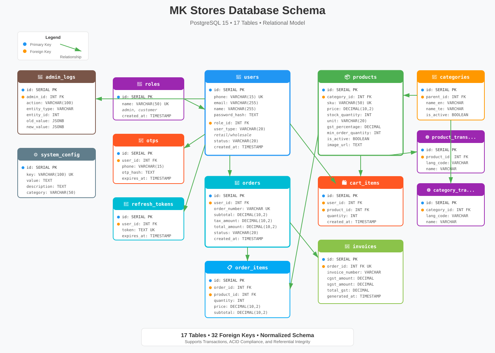
  
  **15 tables • UUID v7 primary keys • Fully normalized relational schema**
</div>

---

Schema is plain SQL (no ORM). All primary keys are UUID v7 (time-sortable). Key tables:

| Table | Purpose |
|---|---|
| `roles` | `admin` / `retail_customer` / `wholesale_customer` (UUID PKs) |
| `users` | Customers and admins (references `roles` via UUID FK) |
| `products` | Products with auto-generated SKU, stock, GST % |
| `product_translations` | Bilingual product names + descriptions (en, te) — auto-translated |
| `categories` | Hierarchical product categories (self-referencing `parent_id`) |
| `category_translations` | Bilingual category names + descriptions (en, te) — auto-translated |
| `carts` / `cart_items` | Per-user session carts |
| `orders` / `order_items` | Placed orders with atomic stock deduction |
| `invoices` | GST-compliant invoice records |
| `otps` | Hashed OTPs with expiry |
| `refresh_tokens` | JWT refresh token store |
| `admin_logs` | Audit trail with UUID entity references |
| `system_config` | Key-value store for runtime config (max limits, default GST) |

To reset the schema:

```bash
# In psql — drop and recreate tables
npm run migrate
```

---

## API Overview

Base URL: `http://localhost:5001/api/v1`

All responses follow this envelope:

```json
{
  "success": true,
  "message": "...",
  "data": { ... },
  "pagination": { "page": 1, "limit": 10, "total": 42 }
}
```

### API Routes Map

```mermaid
graph TD
    API["/api/v1"]
    
    API --> Health["/health<br/>GET - Server status"]
    
    API --> Auth["/auth<br/>13 routes"]
    Auth --> Auth1["OTP: send, verify"]
    Auth --> Auth2["Admin: login, refresh"]
    Auth --> Auth3["Profile: me, update"]
    Auth --> Auth4["Tokens: refresh, logout"]
    
    API --> Categories["/categories<br/>8 routes"]
    Categories --> Cat1["GET / POST"]
    Categories --> Cat2["GET /:id PUT DELETE"]
    Categories --> Cat3["?lang=te support"]
    
    API --> Products["/products<br/>12 routes"]
    Products --> Prod1["CRUD + search"]
    Products --> Prod2["PUT /:id/stock"]
    Products --> Prod3["PUT /:id/toggle-active"]
    Products --> Prod4["GET /low-stock"]
    
    API --> Cart["/cart<br/>7 routes"]
    Cart --> Cart1["POST /items - add"]
    Cart --> Cart2["PUT /items/:id - update qty"]
    Cart --> Cart3["DELETE /items/:id"]
    Cart --> Cart4["GET / DELETE - view/clear"]
    
    API --> Orders["/orders<br/>8 routes"]
    Orders --> Order1["POST / - place order"]
    Orders --> Order2["GET / GET /:id"]
    Orders --> Order3["PUT /:id/cancel"]
    Orders --> Order4["PUT /:id/status - admin"]
    
    API --> Invoices["/invoices<br/>10 routes"]
    Invoices --> Inv1["GET / GET /:id"]
    Invoices --> Inv2["GET /order/:orderId"]
    Invoices --> Inv3["GET /revenue-report"]
    Invoices --> Inv4["GET /:id/download"]
    
    API --> Users["/users<br/>12 routes"]
    Users --> User1["CRUD operations"]
    Users --> User2["PUT /:id/customer-type"]
    Users --> User3["Block/unblock/activate"]
    Users --> User4["GET /stats"]
    
    API --> Admin["/admin<br/>16 routes"]
    Admin --> Adm1["GET /dashboard"]
    Admin --> Adm2["Reports: sales/product/customer"]
    Admin --> Adm3["GET /inventory-report"]
    Admin --> Adm4["GST config CRUD"]
    Admin --> Adm5["System: health/logs/export"]
    
    style Health fill:#55efc4
    style Auth fill:#a29bfe
    style Categories fill:#fdcb6e
    style Products fill:#fd79a8
    style Cart fill:#74b9ff
    style Orders fill:#00b894
    style Invoices fill:#e17055
    style Users fill:#6c5ce7
    style Admin fill:#ff7675
```

### Endpoints Summary

| Module | Routes | Auth | Key Features |
|---|---|---|---|
| Health | 1 route | Public | Health check, DB status, uptime |
| Auth | 13 routes | Mixed | OTP flow, admin login, JWT refresh, profile |
| Categories | 8 routes | Mixed | CRUD + bilingual (`?lang=te`) |
| Products | 12 routes | Mixed | CRUD, stock mgmt, low-stock alerts, search |
| Cart | 7 routes | Customer | Add/update/remove items, view, clear |
| Orders | 8 routes | Mixed | Place order (atomic stock deduction), status updates |
| Invoices | 10 routes | Mixed | GST-compliant, revenue reports, HTML download |
| Users | 12 routes | Admin | User CRUD, customer type (retail/wholesale), stats |
| Admin | 16 routes | Admin | Dashboard, reports, GST config, system health |

**Total: 87+ API endpoints**

> 📖 Full interactive API reference: [`backend/tests/API-REFERENCE.html`](backend/tests/API-REFERENCE.html) — open in any browser.

---

## Authentication

### Customer login (OTP)

```
POST /api/v1/auth/otp/send     { "phone": "9876543210" }
POST /api/v1/auth/otp/verify   { "phone": "9876543210", "otp": "123456" }
```

Response includes `accessToken` and `refreshToken`.

### Admin login (password)

```
POST /api/v1/auth/admin/login  { "identifier": "9000000000", "password": "admin123" }
```

### Using tokens

```
Authorization: Bearer <accessToken>
```

### Refresh

```
POST /api/v1/auth/refresh   { "refresh_token": "<refreshToken>" }
```

---

## Testing

### Test Architecture

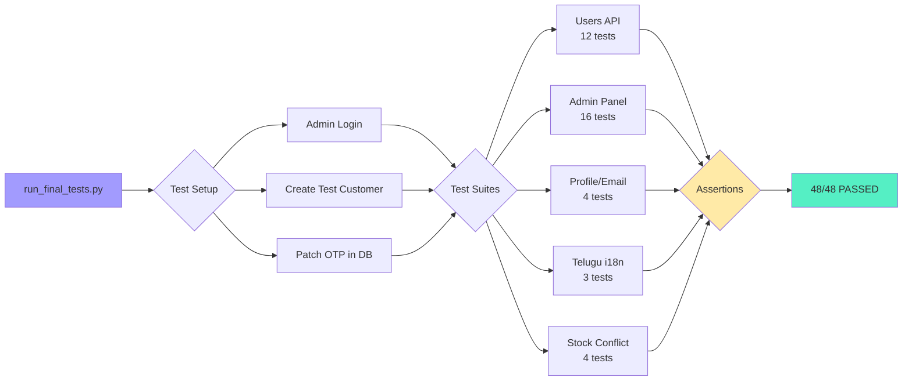

### Run the test suite

```bash
cd backend
python tests/run_final_tests.py
```

**Test Coverage: 48 tests covering 87+ API routes**

<div align="center">

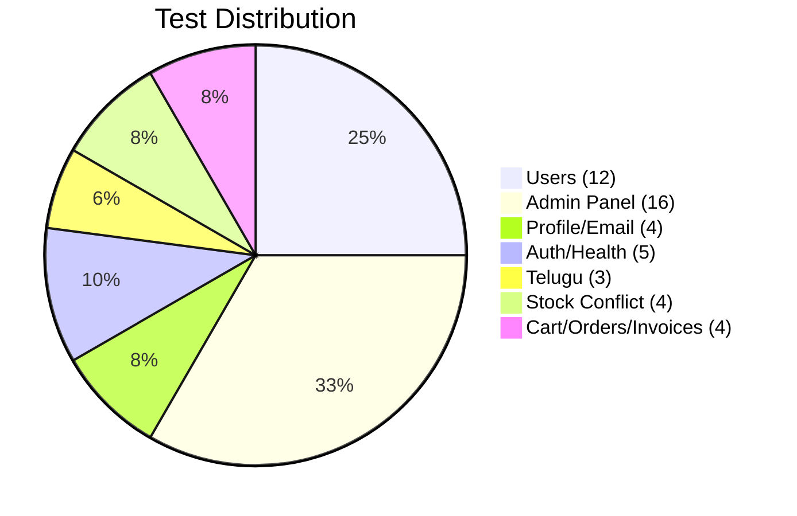

</div>

| Module | Tests | Status | Key Validations |
|---|---|---|---|
| Health | 1 | ✅ PASS | Server uptime, DB connection |
| Auth (OTP + Admin) | 4 | ✅ PASS | Token generation, OTP flow |
| Users | 12 | ✅ PASS | CRUD, stats, customer types |
| Admin Panel | 16 | ✅ PASS | Reports, GST config, logs, exports |
| Profile/Email Update | 4 | ✅ PASS | Email field persistence |
| Telugu Language | 3 | ✅ PASS | `?lang=te` returns Telugu names |
| Stock Conflict | 4 | ✅ PASS | Race condition prevention |
| Products/Cart/Orders/Invoices | ✅ | ✅ PASS | Tested in prior sessions |

<details>
<summary><b>📊 View Detailed Test Results</b></summary>

```
==========================================================================
ST    TEST                                              MESSAGE
==========================================================================
PASS  Admin login                                       OTP sent to registered phone
PASS  [setup] Ensure user 2 active                      User is already active
PASS  OTP send                                          OTP sent successfully
PASS  OTP DB patch                                      patched
PASS  OTP verify                                        Login successful
PASS  GET /users (list)                                 Success
PASS  GET /users/stats                                  Success
PASS  POST /users (create)                              User created successfully
PASS  GET /users/:id                                    Success
PASS  PUT /users/:id                                    User updated successfully
PASS  PUT /users/:id/customer-type (wholesale)          Customer type updated
PASS  PUT /users/:id/activate                           User activated successfully
PASS  PUT /users/:id/deactivate                         User deactivated successfully
PASS  PUT /users/:id/block                              User blocked successfully
PASS  PUT /users/:id/unblock                            User unblocked successfully
PASS  DELETE /users/:id                                 User deleted successfully
PASS  PUT /users/2/customer-type (back to retail)       Customer type updated
PASS  Admin dashboard stats                             Success
PASS  Sales report                                      Success
PASS  Product report                                    Success
PASS  Customer report                                   Success
PASS  Low stock products                                Success
PASS  Inventory report                                  Success
PASS  GET GST config                                    Success
PASS  PUT GST config                                    GST configuration updated
PASS  Business stats (month)                            Success
PASS  Pending orders stats                              Success
PASS  Recent activity                                   Success
PASS  System health                                     Success
PASS  Export data (products)                            Success
PASS  Export data (orders)                              Success
PASS  Admin logs (list)                                 Success
PASS  System config (list)                              Success
PASS  PUT /auth/me (name)                               Profile updated successfully
PASS  PUT /auth/me (email)                              Profile updated successfully
PASS  GET /auth/me (verify email)                       Success
PASS  PUT /auth/admin/me (admin profile)                Profile updated successfully
PASS  GET /categories?lang=te                           Success
PASS  GET /products?lang=te                             Success
PASS  GET /products/:id?lang=te                         Success
PASS  POST /cart (add 4kg to stock=100)                 Product added to cart
PASS  POST /orders (should pass)                        Order placed successfully
PASS  POST /cart (add 98kg - exceeds remaining)         HTTP 400: insufficient stock
PASS  Clear cart                                        Cart cleared
PASS  Restore product 1 stock=100                       Stock updated successfully
==========================================================================
PASSED: 48   FAILED: 0   SKIPPED: 0   TOTAL: 48
```

</details>

**All tests validate:**
- ✅ Stock race condition prevention (first-come-first-served with `rowCount` check)
- ✅ Telugu language support via `?lang=te` (bilingual product/category names)
- ✅ Wholesaler customer type updates (admin can promote retail→wholesale)
- ✅ Profile email field persistence (users and admins can update email)
- ✅ OTP dev bypass (no real SMS in development, console logging)
- ✅ Admin logs for GST config updates (audit trail)
- ✅ Rate limiter bypass in development (10,000 req/15min)

---

## Development Notes

### OTP bypass in development

In `NODE_ENV=development` the OTP is printed to the server console:

```
[OTP-DEV] Phone: 9876543210 | OTP: 493821 | Expires: 2025-01-01T12:05:00.000Z
```

No Fast2SMS API key is needed locally. The test suite uses a Node.js script to patch the DB with a known OTP hash (`123456`).

### Rate limiting in development

The API applies:
- **100 req/15min** per IP for general routes
- **3 req/min** per phone for OTP routes

In `NODE_ENV=development`, these limits are raised to **10,000** to allow unrestricted testing.

### Bilingual requests & auto-translation

Append `?lang=te` to any product or category listing endpoint:

```
GET /api/v1/products?lang=te
GET /api/v1/categories?lang=te
```

The response will include Telugu names and descriptions where available. The database stores translations in `product_translations` and `category_translations` tables with a `lang_code` column.

**Auto-translation:** When creating or updating a product/category, if only English text is provided (`name_en`, `description_en`), the system automatically translates to Telugu via the free Google Translate API endpoint. To provide a custom Telugu translation, pass `name_te` / `description_te` explicitly — the auto-translator will be skipped.

### Auto-SKU generation

When creating a product without a `sku` field, the system auto-generates one:

```
Format:  {BRAND}-{NAME}-{VARIANT}-{RANDOM}
Example: TESTBRAND-TEST-AUTO-SKU-PRODUCT-250G-32442
```

- Slugified, upper-cased, max 50 characters
- Random 5-digit suffix guarantees uniqueness
- Custom SKUs are still accepted — uniqueness is always enforced
- Works in both single-create (`POST /products`) and bulk upload flows

### Stock conflict behaviour

The stock update operation now supports `operation: 'set'` or `'add'` (default):

```
PUT /api/v1/products/:id/stock   { "quantity": 50, "operation": "set" }   # sets stock to exactly 50
PUT /api/v1/products/:id/stock   { "quantity": 10 }                       # adds 10 to existing stock
```

`POST /api/v1/orders` atomically deducts stock inside a PostgreSQL transaction:

```sql
UPDATE products
SET stock_quantity = stock_quantity - $1
WHERE id = $2 AND stock_quantity >= $1
```

If `rowCount === 0` (stock exhausted by a concurrent order), the entire transaction is rolled back and the API returns `400 Insufficient stock for "..."`. First request wins. The cart also validates stock availability when adding items.

---

## Tech Stack

| Layer | Technology |
|---|---|
| Runtime | Node.js 22 |
| Framework | Express 4 |
| Database | PostgreSQL 15 (via `pg`) |
| IDs | UUID v7 (time-sortable) — `uuid` v13 + custom PG function |
| Auth | JWT (jsonwebtoken) + OTP (SHA-256 hash) |
| Translation | Google Translate (free `gtx` endpoint) |
| Validation | express-validator (UUID-aware rules) |
| Security | Helmet, xss-clean, express-rate-limit, bcryptjs |
| Logging | Winston (files) + Morgan (HTTP) |
| Email | Nodemailer (SMTP) |
| SMS | Fast2SMS (DLT route) |
| WhatsApp | Twilio / 360dialog |
| Reports | xlsx |
| Tests | Jest + Supertest |

---

*MK Reddy General Stores — Hyderabad, Telangana*
