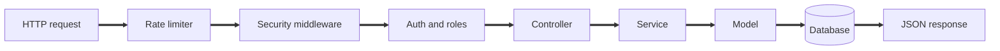

# Backend API

The backend is an Express API that powers catalog, cart, orders, admin operations, notifications, and reporting. It uses PostgreSQL by default and can switch to MySQL without code changes.

## Table of Contents

1. [Executive Summary](#executive-summary)
2. [User Journeys](#user-journeys)
3. [Application Architecture](#application-architecture)
4. [Route Map](#route-map)
5. [Component and Feature Organization](#component-and-feature-organization)
6. [State and Data Strategy](#state-and-data-strategy)
7. [API Contract and Responses](#api-contract-and-responses)
8. [Authentication Behavior](#authentication-behavior)
9. [Caching and Performance](#caching-and-performance)
10. [Security Hardening](#security-hardening)
11. [Observability](#observability)
12. [Project Layout](#project-layout)
13. [Environment Configuration](#environment-configuration)
14. [Developer Workflow](#developer-workflow)
15. [Testing Strategy](#testing-strategy)
16. [Build and Deployment Guidance](#build-and-deployment-guidance)
17. [Troubleshooting](#troubleshooting)

## Executive Summary

* Express API with PostgreSQL by default and optional MySQL support
* Auth flows for Google OAuth, email OTP, and admin password plus OTP
* Catalog, cart, orders, and invoices with GST support
* Admin reporting, exports, notifications, and operational metrics

## User Journeys

Customer API journey

1. Authenticate with Google OAuth or email OTP
2. Fetch categories and products with language support
3. Create cart items and place orders
4. Retrieve order history and invoices

Admin API journey

1. Authenticate with password and OTP
2. Manage categories, products, and pricing
3. Monitor orders and inventory
4. Export data and review reports

## Application Architecture



## Route Map

Health and diagnostics

* GET /health
* GET /ping
* GET /docs
* GET /health-check
* GET /health-check/detailed
* GET /health-check/metrics

Auth and profile

* POST /auth/google/login and /auth/google/register
* POST /auth/email-otp/send, /auth/email-otp/verify, /auth/email-otp/register
* POST /auth/admin/login and /auth/admin/verify-otp
* POST /auth/refresh, /auth/logout, /auth/logout-all
* GET /auth/me and PUT /auth/me

Catalog

* GET /categories and GET /products
* GET /products/search and GET /products/popular
* Admin create and update endpoints for categories and products

Commerce

* /cart endpoints for cart lifecycle
* /orders endpoints for order placement and status
* /invoices endpoints for billing and downloads

Admin operations

* /admin dashboard, reports, GST config, and exports
* /notifications for alert workflows
* /settings for store and voice dictionary
* /birthday-offers and /birth-day for campaigns

## Component and Feature Organization

* src/routes for endpoint grouping
* src/controllers for request validation and response shaping
* src/services for business logic
* src/models for database access
* src/middlewares for auth, caching, rate limiting, and upload
* src/utils for shared helpers

## State and Data Strategy

* UUID v7 primary keys on all core tables
* Translation tables for categories and products
* Cart and order records store price snapshots
* Admin logs record changes for audit purposes

## API Contract and Responses

* Most responses include success, message, and data
* Pagination data includes page, limit, and total counts
* Errors return appropriate HTTP status codes with an error message

Example success payload

```
{
  "success": true,
  "message": "OK",
  "data": {}
}
```

Example error payload

```
{
  "success": false,
  "message": "Unauthorized"
}
```

## Authentication Behavior

* Access tokens are short lived JWT tokens
* Refresh tokens are rotated and revoked on logout
* Admin logins require OTP verification
* Account merge flow is triggered on phone conflicts

## Caching and Performance

* Cache middleware for products and categories
* Response compression with gzip
* Connection pool tuning for concurrency
* Indexes for catalog filters and admin analytics

## Security Hardening

* Bcrypt work factor set to 12
* Account lockout after repeated failures
* Request signing for frontend revalidation
* CSP and redirect validation
* Optional uploads authentication

## Observability

* GET /health for liveness
* GET /health-check/detailed for monitoring data
* GET /health-check/metrics for pool statistics

## Project Layout

```
backend/
  src/
    routes/
    controllers/
    services/
    models/
    middlewares/
    database/
    utils/
  scripts/
  package.json
```

## Environment Configuration

Core

* NODE\_ENV
* PORT
* DB\_HOST
* DB\_PORT
* DB\_USER
* DB\_PASSWORD
* DB\_NAME
* DB\_TYPE

Auth and security

* JWT\_SECRET
* JWT\_REFRESH\_SECRET
* GOOGLE\_CLIENT\_ID
* GOOGLE\_CLIENT\_SECRET
* REVALIDATION\_SECRET

Email and OTP

* SMTP\_HOST
* SMTP\_PORT
* SMTP\_USER
* SMTP\_PASS

## Developer Workflow

1. cd backend
2. npm install
3. npm run migrate
4. npm run dev

## Testing Strategy

* Jest for API tests
* Test coverage focuses on auth, catalog, orders, and admin flows

## Build and Deployment Guidance

* Set environment variables for the target environment
* Run migrations before starting the API
* Start server with npm start
* Verify /health and /health-check/detailed

## Troubleshooting

* Health check fails: verify DB connection and credentials
* OAuth login fails: verify Google client id and secret
* OTP not delivered: verify SMTP settings
* MySQL errors: ensure DB\_TYPE is set to mysql and migration ran

